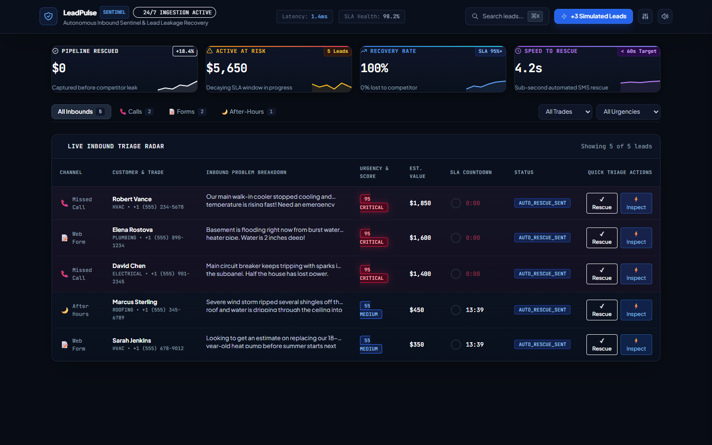
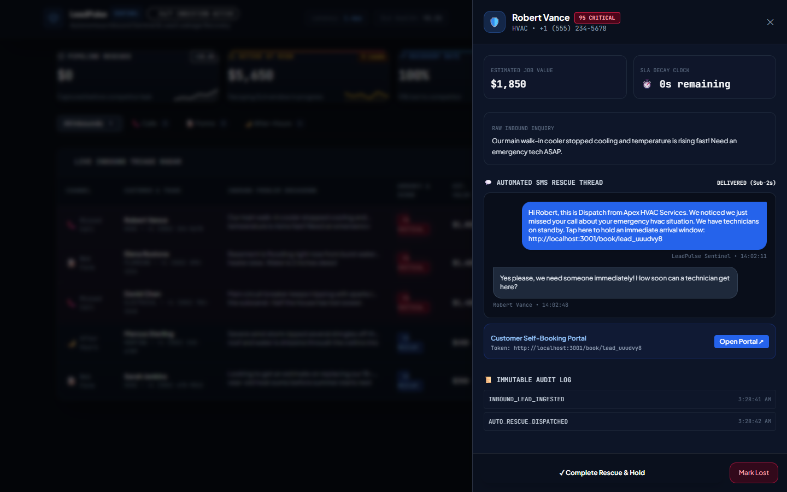
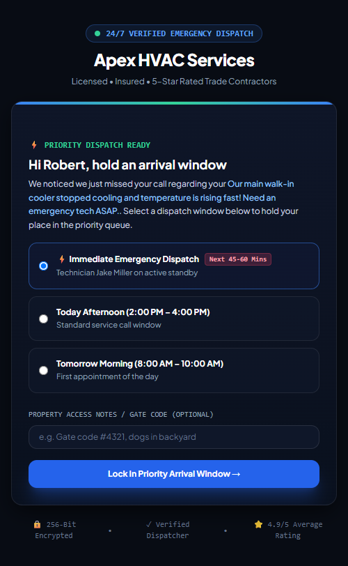
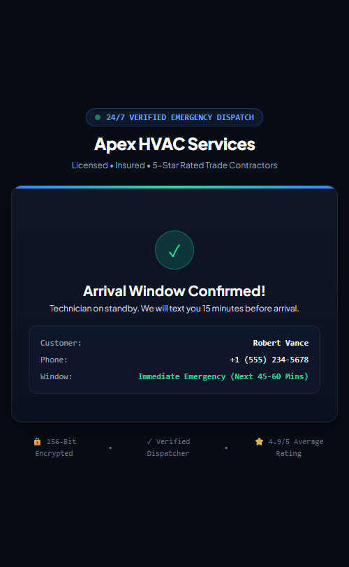
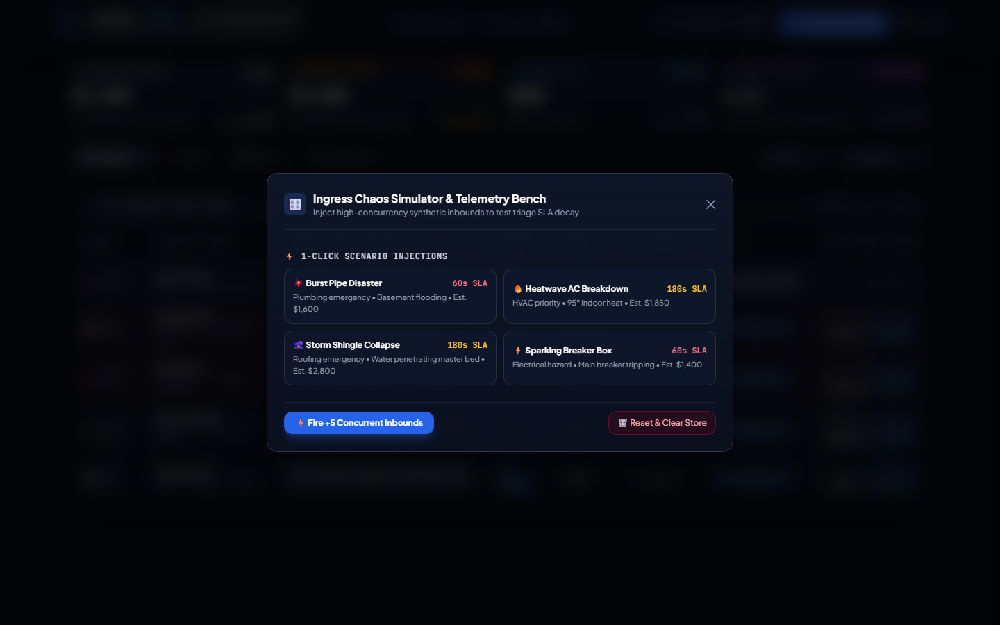
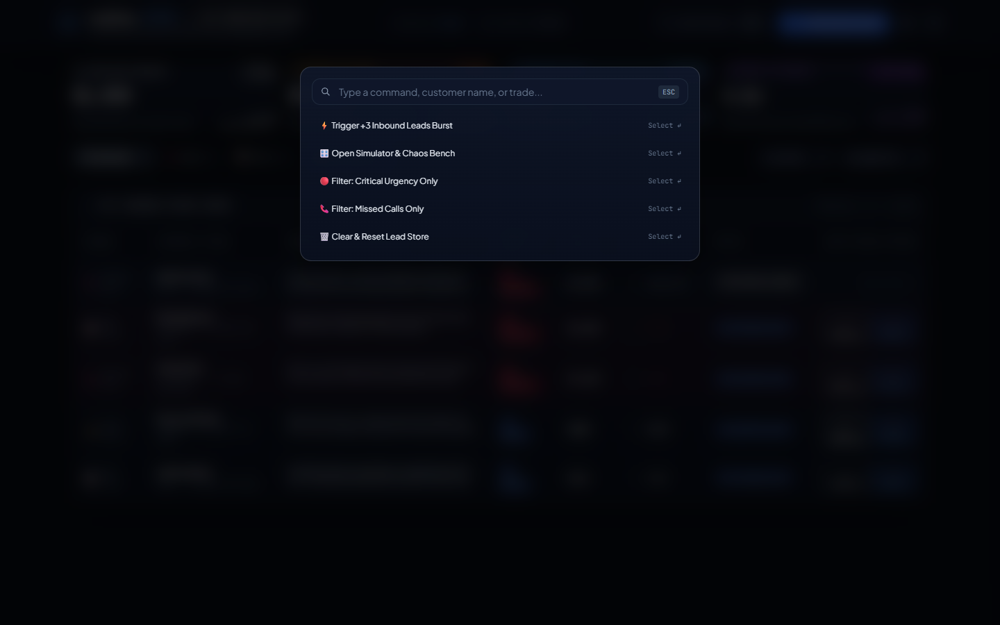

# LeadPulse Sentinel 🛡️

> **Autonomous Inbound Sentinel & Lead Leakage Prevention Engine**  
> *Engineered for High-Velocity Trade Contractors (HVAC, Plumbing, Electrical, Roofing, Restoration)*

[](tests/)
[](tests/)
[](docs/02_developer_guide.md)
[](src/server/)
[](LICENSE)

---

## 📌 The Problem: The High Cost of Speed-to-Lead Decay

In emergency home services and specialized trade contracting, **78% of customers buy from the first business that responds**. 

Yet, due to active job-site work, driving, and after-hours coverage gaps, the average trade business misses **25% to 62% of inbound calls and web inquiries**. When an inquiry goes unanswered for longer than **5 minutes**:
- Lead qualification odds drop by **21x**.
- Over **80% of homeowners** immediately call the next competitor on Google.
- A single missed AC failure or ruptured water pipe costs contractors **$1,600 to $8,500+ in lost revenue**.

**LeadPulse Sentinel** eliminates this leakage entirely by acting as an autonomous, sub-second inbound sentinel. It intercepts missed calls, web forms, and after-hours inquiries, classifies urgency and financial value in $<10\text{ms}$, and instantly dispatches an interactive SMS rescue link that allows homeowners to hold an emergency arrival window before they dial a competitor.

---

## 🖥️ Live Mission Control Previews

### 1. Enterprise Mission Control & Live Triage Radar
Real-time telemetry dashboard featuring live SLA decay gauges, urgency scores, dynamic SVG sparkline charts, and one-click triage dispatching.



---

### 2. Slide-Over Lead Inspector & Live SMS Stream
Detailed customer dossier with dollar valuation breakdown, simulated 2-way SMS conversation thread, and immutable audit logging.



---

### 3. Customer-Facing Mobile Self-Booking Experience (`/book/:id`)
Apple-grade, trustworthy mobile reservation portal sent via SMS, allowing homeowners to reserve an emergency arrival window in under 30 seconds.

<p align="center">
  
  &nbsp;&nbsp;&nbsp;&nbsp;
  
</p>

---

### 4. Ingress Chaos Simulator & Command Palette (`⌘K`)
Developer and dispatcher test bench for injecting high-concurrency synthetic emergency bursts and running rapid keyboard shortcuts.

<p align="center">
  
  &nbsp;&nbsp;
  
</p>

---

## ✨ Key Features & Capabilities

- ⚡ **Sub-Second Automated Rescue (< 2s)**: Dispatches personalized SMS messages with unique single-use booking tokens immediately upon missed call detection.
- 🎯 **Deterministic NLP Urgency Classifier ($L_{\text{score}} \in [0, 100]$)**: Identifies life-safety risks (burst pipes, sparking electrical panels, freezing furnaces) and dynamically maps SLA response windows ($60\text{s}$ to $300\text{s}$).
- 💰 **Dynamic Job Valuation Model**: Estimates pipeline revenue values ($120 to $12,000) based on trade vertical and emergency severity.
- 📊 **Real-Time Financial Rescue Ledger**: Continuously computes **Pipeline Rescued ($)**, **Active at Risk ($)**, and **Recovery Rate (%)** metrics with live SVG sparkline trendlines.
- ⏱️ **Circular SVG SLA Decay Meters**: Visual countdown dials that transition from Emerald $\rightarrow$ Amber $\rightarrow$ Pulsing Crimson as SLAs decay.
- 📱 **Mobile Customer Scheduling Portal**: Frictionless arrival window reservations with gate code capture and digital arrival passes.
- 🎛️ **Ingress Chaos Simulator**: Built-in testing suite for firing concurrent webhook bursts and simulating emergency disaster scenarios.
- ⌨️ **Raycast-Style Command Palette (`⌘K` / `Ctrl+K`)**: Rapid keyboard navigation and instant triage actions.
- 🔊 **Web Audio Tactile Acoustic Feedback**: Synthesized audio chimes for operational feedback during high-stakes triage.
- 🚀 **Zero-Dependency Native Architecture**: Runs standalone on Node.js 20+ with 100% standard libraries—zero external runtime dependencies required.

---

## 🏗️ System Architecture

```
[ Inbound Multi-Channel Ingress ]
 (Missed Calls, Web Forms, After-Hours, VoIP Webhooks)
                     │
                     ▼
┌─────────────────────────────────────────────────────────────┐
│                 LeadPulse Sentinel Core                     │
│                                                             │
│   ┌────────────────────────┐    ┌───────────────────────┐   │
│   │ Urgency Classifier     │    │ Financial Valuation   │   │
│   │ (NLP Keyword Matcher)  │    │ Model ($120 - $12k)   │   │
│   └───────────┬────────────┘    └───────────┬───────────┘   │
│               │                             │               │
│               ▼                             ▼               │
│   ┌─────────────────────────────────────────────────────┐   │
│   │             In-Memory Event Ledger Store            │   │
│   │     (Immutable Audit Events & KPI Aggregations)     │   │
│   └─────────────────────────┬───────────────────────────┘   │
│                             │                               │
│                             ▼                               │
│   ┌─────────────────────────────────────────────────────┐   │
│   │           Auto-Rescue Dispatcher Engine             │   │
│   │         (Sub-2s SMS Payload & Token URL)            │   │
│   └─────────────────────────────────────────────────────┘   │
└─────────────────────────────┬───────────────────────────────┘
                              │
             ┌────────────────┴────────────────┐
             ▼                                 ▼
┌─────────────────────────┐       ┌─────────────────────────┐
│ Dispatcher Command UI   │       │ Homeowner Mobile Portal │
│ (Live Triage Radar,     │       │ (/book/:id Interactive  │
│  SLA Gauges, KPIs, ⌘K)  │       │  Emergency Arrival Pass)│
└─────────────────────────┘       └─────────────────────────┘
```

---

## 🚀 Quickstart

### Prerequisites
- [Node.js 20.0+](https://nodejs.org/)

### Installation & Launch

```bash
# 1. Clone the repository
git clone https://github.com/HamzaKhanBUIC/leadpulse-sentinel.git
cd leadpulse-sentinel

# 2. Launch the Sentinel Server (Serves API & Web UI)
node src/server/index.js
```

Open your browser and navigate to:
- **Mission Control Dashboard**: `http://localhost:3001`
- **Customer Self-Booking Preview**: `http://localhost:3001/book/lead_uuudvy8`

---

## 🧪 Automated Test Suite

LeadPulse includes a zero-dependency, multi-tier automated test suite executed via the native Node.js test runner:

```bash
node --test tests/standalone_runner.js
```

### Test Suite Coverage

```
▶ 1. Urgency Classifier & NLP Triage Engine (4 tests) - PASSED
▶ 2. Financial Valuation Model (4 tests) - PASSED
▶ 3. AutoRescue Dispatcher Engine (1 test) - PASSED
▶ 4. End-to-End Leakage Recovery Scenario (1 test) - PASSED
▶ 5. Full Native API Server & REST Endpoints (1 test) - PASSED
▶ 6. Adversarial Chaos & High-Concurrency Edge Cases (3 tests) - PASSED

✔ Total Tests: 14 | Passed: 14 | Failed: 0 | Duration: < 300ms
```

---

## 📡 REST API Reference

| Method | Endpoint | Description |
|---|---|---|
| `GET` | `/api/v1/leads` | Retrieve all monitored inbound leads with SLA decay status |
| `POST` | `/api/v1/leads/ingest` | Ingest webhook from VoIP / Form (`channel`, `customer_phone`, `raw_inquiry_text`) |
| `GET` | `/api/v1/leads/:id` | Fetch detailed customer dossier and audit trail |
| `POST` | `/api/v1/leads/:id/action` | Dispatcher action (`MARK_RESCUED`, `MARK_LOST`) |
| `POST` | `/api/v1/leads/:id/book` | Customer self-service slot reservation (`slot_id`, `notes`) |
| `GET` | `/api/v1/metrics` | Retrieve real-time financial ledger KPIs ($ rescued, $ at risk, recovery %) |
| `POST` | `/api/v1/simulate/burst` | Fire synthetic concurrent lead burst (`count: 3`) |
| `POST` | `/api/v1/simulate/clear` | Purge and reset database store |

---

## 📁 Repository Structure

```
leadpulse-sentinel/
├── docs/
│   ├── assets/screenshots/           # High-resolution UI captures
│   ├── 01_user_guide.md              # Dispatcher operational guide
│   ├── 02_developer_guide.md         # Engineering & architecture handbook
│   ├── 03_deployment_runbook.md      # Docker & production setup
│   └── 04_known_limitations.md       # Scope boundaries & roadmap
├── src/
│   ├── types/index.ts                # TypeScript canonical schemas
│   ├── core/
│   │   ├── sentinel/urgencyClassifier.js # NLP urgency & SLA calculation
│   │   ├── sentinel/valuationModel.js    # Trade job valuation algorithms
│   │   ├── rescue/autoRescueDispatcher.js# Sub-2s SMS generator
│   │   ├── ledger/eventStore.js          # In-memory event ledger & KPI engine
│   │   └── simulator/leadEmitter.js      # Synthetic scenario generator
│   ├── adapters/
│   │   └── ingress/leadNormalizer.js     # Webhook ingress parser & validator
│   └── server/
│       ├── nativeServer.js               # Standalone HTTP engine & UI server
│       └── index.js                      # Application entrypoint
├── tests/
│   └── standalone_runner.js          # Native automated test runner
└── README.md                         # Project documentation
```

---

## 📄 License

Distributed under the MIT License. See [LICENSE](LICENSE) for more information.
