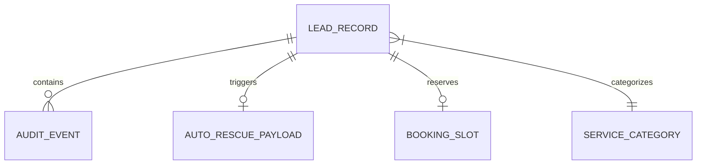

# Data Model Schemas & Type Definitions

## 1. Entity-Relationship Model



---

## 2. Canonical TypeScript Interfaces

```typescript
export type InboundChannel = 'MISSED_CALL' | 'WEB_FORM' | 'AFTER_HOURS' | 'DIRECT_WEBHOOK';

export type UrgencyTier = 'CRITICAL' | 'HIGH' | 'MEDIUM' | 'LOW';

export type LeadStatus = 
  | 'NEW_UNTOUCHED'
  | 'AUTO_RESCUE_SENT'
  | 'CUSTOMER_CLICKED'
  | 'APPOINTMENT_BOOKED'
  | 'DISPATCHER_ENGAGED'
  | 'RESCUED'
  | 'LOST_BREACHED';

export type ServiceTrade = 
  | 'HVAC'
  | 'PLUMBING'
  | 'ELECTRICAL'
  | 'ROOFING'
  | 'RESTORATION'
  | 'GENERAL_SERVICE';

export interface AuditEvent {
  id: string;
  lead_id: string;
  timestamp: string;
  action: string;
  actor: 'SYSTEM_SENTINEL' | 'CUSTOMER' | 'DISPATCHER';
  details: Record<string, unknown>;
}

export interface BookingSlot {
  slot_id: string;
  start_time: string;
  end_time: string;
  technician_name?: string;
  is_emergency: boolean;
}

export interface AutoRescuePayload {
  message_id: string;
  recipient_phone: string;
  sent_at: string;
  message_body: string;
  interactive_booking_url: string;
  delivery_status: 'QUEUED' | 'DELIVERED' | 'FAILED';
}

export interface LeadRecord {
  id: string;
  created_at: string;
  updated_at: string;
  channel: InboundChannel;
  trade: ServiceTrade;
  customer_name: string;
  customer_phone: string;
  customer_email?: string;
  customer_address?: string;
  raw_inquiry_text: string;
  
  // Triage & Urgency
  urgency_tier: UrgencyTier;
  l_score: number; // 0 to 100
  sla_seconds_total: number;
  sla_expires_at: string;
  estimated_job_value_usd: number;
  
  // State Progression
  status: LeadStatus;
  assigned_dispatcher?: string;
  rescue_payload?: AutoRescuePayload;
  booked_slot?: BookingSlot;
  resolution_notes?: string;
  
  // Audit Trail
  audit_trail: AuditEvent[];
}

export interface RevenueLedgerMetrics {
  total_inbound_leads: number;
  active_leads_count: number;
  rescued_leads_count: number;
  lost_leads_count: number;
  
  leakage_rate_pct: number;
  recovery_rate_pct: number;
  
  pipeline_value_total_usd: number;
  pipeline_value_at_risk_usd: number;
  pipeline_value_rescued_usd: number;
  pipeline_value_lost_usd: number;
  
  median_speed_to_rescue_seconds: number;
}
```
