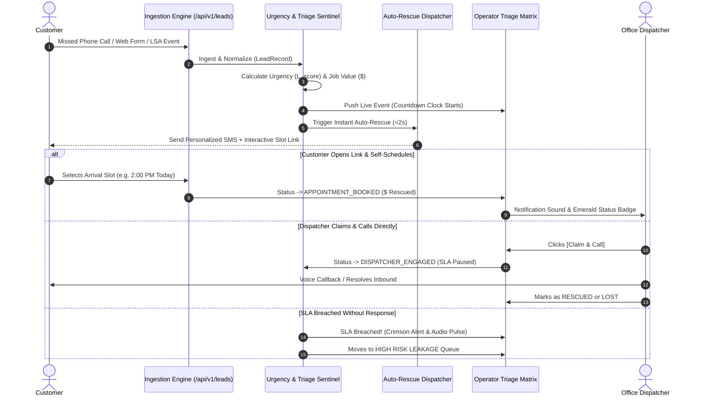

# User Flows, State Machines & UI States: LeadPulse

## 1. End-to-End Inbound Triage & Rescue Flow

---

## 2. The 5 Mandatory UI View States

| UI State | Visual Representation | User Actions Available |
|---|---|---|
| **1. Empty State** | Clean illustration, message: *"No active lead leakage. All phone lines & forms monitored 24/7."* | `[Simulate Inbound Test Lead]`, `[View Historical Rescues]` |
| **2. Loading / Ingesting State** | Subtle skeleton shimmer with optimistic row insertion. | Queue remains interactive. |
| **3. Normal / Active State** | Triage table with active countdown timers, channel icons (Phone/Form), urgency pills, and dollar estimates. | Filter by Channel/Urgency, Search by Name/Phone, Click row for details. |
| **4. High-Alert / Breach State** | Top sticky banner pulsing red with count of leads $< 60\text{s}$ from competitor loss. Audio alert chime. | `[Emergency Claim All]`, `[Auto-Dispatch Technician]` |
| **5. Error / Offline State** | Warning banner: *"Local storage fallback active. All leads safely queued."* | `[Retry Connection]`, `[Export CSV Backup]` |
