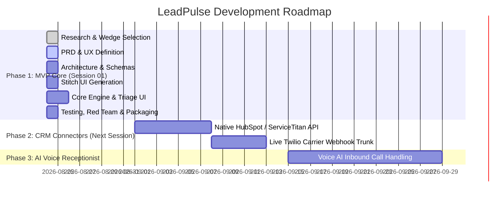

# Product Release Roadmap: LeadPulse

---

## Release Milestones

---

## MVP Scope (Session 01)
- Ingestion engine with multi-channel payload normalization.
- Real-time SLA countdown and urgency classifier ($L_{\text{score}}$).
- Instant auto-rescue messaging and interactive slot picker.
- Triage Matrix UI with live status transitions and lead detail drawer.
- Financial revenue impact calculator with real-time tally.
- Simulated lead injection test harness for live demo & adversarial QA.

## Future Horizons
- **Horizon 2**: Direct 2-way sync with ServiceTitan, Jobber, and Housecall Pro.
- **Horizon 3**: Autonomous conversational voice AI agent answering inbound phone calls in real-time.
