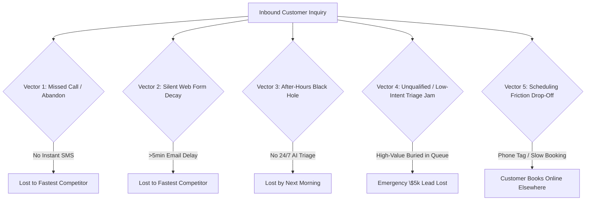

# Lead Leakage Taxonomy & Failure Vector Breakdown

## 1. Exhaustive Taxonomy of Lead Leakage Vectors

Through empirical analysis of service business inbound funnels, we categorize lead leakage into **5 distinct operational failure modes**:

---

## 2. Detailed Breakdown of the 5 Vectors

### Vector 1: The Missed Call / Voicemail Drop
- **Mechanism**: Inbound phone call rings while staff is on another line, driving, or with a client. Caller hits voicemail.
- **Root Cause**: SMBs lack multi-line PBX rollover and have single-point-of-failure human front desks.
- **Frequency**: 25%–40% of all daytime inbound calls.
- **Consequence**: 80%+ hang up without leaving voicemail; call the next search result.
- **Defensive Counter-Measure**: Instant (<10s) Missed-Call Auto-Rescue SMS with conversational intake.

### Vector 2: Silent Web Form Decay
- **Mechanism**: Customer submits a "Get a Quote" or "Book Service" form on website. Form sends an unmonitored email to `info@company.com`.
- **Root Cause**: Lack of webhook automation; inbox is checked periodically (hours or days later).
- **Frequency**: 60%–80% of web form inquiries.
- **Consequence**: Response latency exceeds 4 hours, decreasing qualification probability by 60x.
- **Defensive Counter-Measure**: Real-time webhook ingestion + immediate SMS/Email acknowledgment with live booking link.

### Vector 3: The After-Hours & Weekend Black Hole
- **Mechanism**: Inquiries arrive between 6:00 PM and 8:00 AM or over the weekend when the office is closed.
- **Root Cause**: No 24/7 staff or expensive/unreliable outsourced answering service.
- **Frequency**: 30%–45% of total weekly lead volume.
- **Consequence**: By 8:30 AM Monday morning, prospect has already hired an on-call competitor.
- **Defensive Counter-Measure**: 24/7 Autonomous AI Intake & Emergency Slot Reservation.

### Vector 4: High-Value Triage Jam (Unranked Lead Queues)
- **Mechanism**: High-urgency, high-value leads (\$10,000 whole-home HVAC replacement or emergency flood) sit in the same queue behind low-value or spam inquiries (\$50 filter change inquiry).
- **Root Cause**: FIFO (First-In, First-Out) unprioritized queues.
- **Frequency**: Universal across unautomated shops.
- **Consequence**: High-ticket leads leak while reps waste time on low-intent tire-kickers.
- **Defensive Counter-Measure**: Automated Urgency & Value Scoring ($L_{\text{score}}$) with instant high-priority alerts.

### Vector 5: Phone-Tag & Scheduling Friction
- **Mechanism**: Rep calls lead back 30 minutes later; customer doesn't answer. Rep leaves voicemail. Days of "phone tag" ensue.
- **Root Cause**: Requiring synchronous voice calls to negotiate calendar availability.
- **Frequency**: 50%+ of outbound callbacks.
- **Consequence**: 60% of phone-tag sequences result in ghosting.
- **Defensive Counter-Measure**: One-click asynchronous interactive scheduling links sent directly via SMS.
